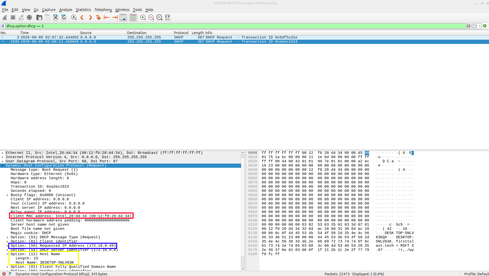
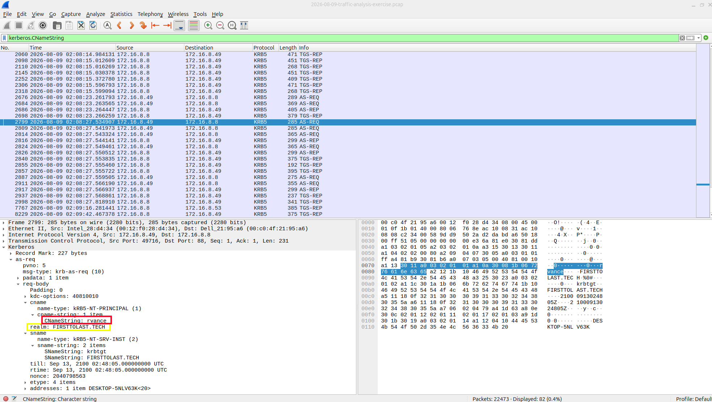
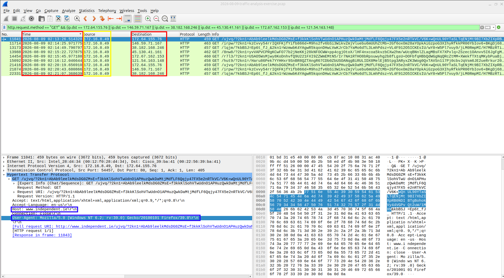
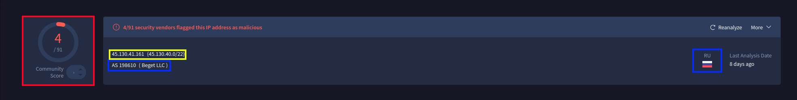
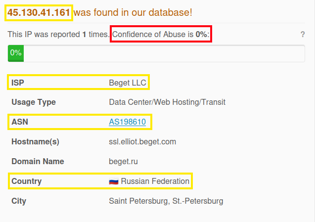

# Incident Report 01: Formbook Malware C2 Investigation 

## 1. Executive Summary  

An endpoint on the internal enterprise network generated automated alerts for outbound HTTP GET traffic directed toward known FormBook Command and Control (C2) infrastructure. This report documents compromised asset identification, user attribution, Wireshark packet analysis, threat intelligence enrichment, and SOC containment recommendations.  

---

## 2. Compromised Host Identification 

| Identification Artifact | Extracted Value | Wireshark Display Filter | Protocol / Header Source |
| :--- | :--- | :--- | :--- |
| **IP Address** | `172.16.8.49` | `dhcp.option.dhcp == 3` | DHCP Option 50 (Requested IP Address) |
| **MAC Address** | `00:12:f0:28:d4:34` | `dhcp.option.dhcp == 3` | Client MAC Address (DHCP Address) |
| **Host Name** | `DESKTOP-5NLV63K` | `dhcp.option.dhcp == 3` | DHCP Option 12 (Host Name) | 
| **User Account Name** | `rvance` | `kerberos.CNameString` | Kerberos Authentication (`CNameString`) |
| **User Full Name** | `Raymond Vance` | `N/A (AD Account Correlation)` | Mapped from sAMAccountName (`rvance`) & Domain (`FIRSTTOLAST.TECH`) | 


*Figure 1: Wireshark packet details isolating the infected endpoint IP (`172.16.8.49`), MAC address (`00:12:f0:28:d4:34`), and Host Name (`DESKTOP-5NLV63K`) using `dhcp.option.dhcp == 3`.*

**Annotation Legend**
* :red_circle:**Red Box (MAC Address):** Highlighted `Client MAC address: 00:12:f0:28:d4:34` field in the DHCP header. 
* :yellow_circle:**Yellow Box (Host Name):** Highlighted `Host Name: DESKTOP-5NLV63K` string inside DHCP Option 12. 
* :large_blue_circle:**Blue Box (Assigned IP):** Highlighted `Requested IP Address: 172.16.8.49` inside DHCP Option 50. 

---


*Figure 2: Wireshark packet details confirming compromised user account name (`rvance`) and Kerberos domain realm (`FIRSTTOLAST.TECH`).* 

* :red_circle:**Red Box (User Account):** Highlighted `CNameString` field showing user logon account (`rvance`). 
* :yellow_circle:**Yellow Box (Domain Realm):** Highlighted `realm` string (`FIRSTTOLAST.TECH`). Full user name (`Raymond Vance`) is attributed via Active Directory profile mapping associated with `rvance`.

## 3. Network Traffic & C2 Analysis

### Outbound FormBook C2 GET Requests

To correlate packet capture evidence with the initial SIEM alert, a targeted display was applied in Wireshark to isolate HTTP GET requests sent directly to the flagged external C2 IP addresses:

```text  
http.request.method == "GET" && (ip.dst == 172.64.155.76 || ip.dst == 146.59.71.167 || ip.dst == 38.182.168.246 || ip.dst == 45.130.41.161 || ip.dst == 121.54.163.148) 
```
*Note: Display filter syntax remains un-defanged above to preserve copy-paste functionality within Wireshark.*


*Figure 3: Wirshark capture isolating outbound C2 check-in traffic to external alert IPs.* 

**Annotation Legend:**
* :red_circle:**Red Boxes (SIEM Alert Match):** Highlighted `Time` and `Destination` columns showing external C2 IPs (`172.64.155[.]76`, `146.59.71[.]167`, `45.130.41[.]161`) and timestamps matching the intial SIEM trigger (`02:13 UTC`)
* :yellow_circle:**Yellow Box (Victim Endpoint):** Highlighted `Source` column showing the internal host IP (`172.16.8.49`) generating outbound malware check-ins. 
* :large_blue_circle:**Blue Boxes (C2 Fingerprinting):** Highlighted `Host:` header and suspicious `User-Agent:` strings extracted from the Hypertext Transfer Protocol details pane.  

---

## 4. Threat Intelligence & Indicator Enrichment 

Extracted Indicators of Compromise (IOCs) were submitted to Threat Intelligence Platforms (TIP) to evaluate risk reputation, host infrastructure, and malware classification. 

### External C2 Indicator Reputation 

| Indicator (IP) | VirusTotal Detections | AbuseIPDB Score | ISP / Hosting Provider | Country / ASN | Threat Infrastructure Role & Notes | 
| :--- | :--- | :--- | :--- | :--- | :--- |
| `172.64.155[.]76` | 0/91 Malicious | 0% Confidence | Cloudflare, Inc. | US / AS13335 | CDN Edge IP / FormBook Decoy Traffic | 
| `172.67.162[.]153` | 0/91 Malicious | 0% Confidence | Cloudflare, Inc. | US / AS13335 | CDN Edge IP /FormBook Decoy Traffic | 
| `121.54.163[.]148` | 1/91 Malicious | 0% Confidence | Smart Communications | HK / AS132839 | External Endpoint / Suspicious GET Target | 
| `146.59.71[.]167` | 1/91 Malicious | 0% Confidence | OVH SAS | FR / AS16276 | Cloud Hosting Provider / Suspicious GET Target |
| `38.182.168[.]246` | 3/91 Malicious | 0% Confidence | CNSERVICES | US / AS40065 | Flagged Endpoint / Low Reputation Host | 
| `45.130.41[.]161` | **4/91 Malicious** | **0% Confidence** | **Beget LLC** | **RU / AS198610** | **Primary C2 Candidate / Bulletproof Hosting Infrastructure** | 


*Figure 4: VirusTotal threat engine analysis for `45.130.41[.]161` confirming malicious vendor flags and hosting infrastructure under Beget LLC (AS198610).* 

**Annotation Legend:**
* :red_circle:**Red Box (Detection Score):** Highlighted `4/91` circular score gauge indicating malicious vendor flags.
* :yellow_circle:**Yellow Box (Target Indicator):** Highlighted target IP address (`45.130.41[.]161`). 
* :large_blue_circle:**Blue Boxes (Hosting Infrastructure):** Highlighted ISP/ASN and origin details (`Beget LLC / AS198610 / RU`). 

---


*Figure 5: AbuseIPDB reputation summary for `45.130.41[.]161` displaying network metadata (Beget LLC, Russia) and a 0% recent crowdsourced confidence score.* 

**Annotation Legend:**
* :red_circle:**Red Box (Confidence Score):** Highlighted `0% Abuse Confidence Score` gauge.
* :yellow_circle:**Yellow Boxes (IP & Host Info):** Highlighted target IP (`45.130.41[.]161`), country flag (RU), and ASN metadata (`AS198610 Beget LLC`). 

---

### Threat Intelligence Correlation & Analysis

While AbuseIPDB reflects a 0% Abuse Confidence Score across external indicators due to a lack of recent crowdsourced web-spam submissions, cross-correlation with VirusTotal detection engines (`4/9 Malicious`) and packet-level HTTP GET check-in patterns confirms outbound communication with FormBook C2 infrastructure hosted on **Beget LLC (AS198610)** infrastructure in Russia (**RU**). Threat actors frequently utilize bulletproof hosting providers across foreign jurisdictions (such as RU, HK, FR, and US endpoints) to bypass Western abuse takedown requests, underscoring the necessity of multi-source threat intelligence enrichment over single reputation databases. 

### Threat Actor Profile: FormBook / XLoader

* **Malware Category:** Infostealer / Keylogger (Malware-as-a-Service).
* **Observed Capabilities:** Steals cached web credentials, log keystrokes, harvests clipboard data, and downloads secondary payloads.
* **C2 Strategy (Decoy Traffic):** FormBook generates noise by contacting legitimate CDNs (e.g., Cloudflare) and benign domains concurrently with active C2 servers to hinder automated sandbox detection.

### MITRE ATT&CK Mapping 

* **`T1071.001` - Application Layer Protocol: Web Protocols**
 * *Evidence:* Formbook malware utilized unencrypted HTTP GET requests over port 80 to communicate outbound with external C2 IP addresses (`45.130.41[.]161`, `38.182.168[.]246`). 
* **`T1082` - System Information Discovery**
 * *Evidence:* Compromised endpoint host attributes (`DESKTOP-5NLV63K`) and IP assignments (`172.16.8.49`) were gathered during initial network discovery. 
* **`T1078.002` - Valid Accounts: Domain Accounts**
 * *Evidence:* Compromised domain user credentials (`rvance` under `FIRSTTOLAST.TECH`) were identified in network authentication traffic.

---

## 5. Indicator Sanitization (OpSec)

To adhere to basic Operational Security (OpSec) standards and prevent accidental clicks, all external Indicators of Compromise (IOCs) in this report have been defanged using manual bracket notation:

* **IPv4 Address Defanging:** `45.130.41.161` $\rightarrow$ `45.130.41[.]161` 
* **URL Scheme Defanging:** `http://` $\rightarrow$ `hxxp://` 

This ensures that security platforms, GitHub markdown renderers, and email gateways treat the indicators as plain text rather than active, clickable hyperlinks. 

---

## 6. Containment & Remediation Recommendations

* [] **Endpoint Isolation:** Quarantine `DESKTOP-5NLV63K` (`172.16.8.49`) from the network immediately via EDR or network switch port shutdown.
* [] **Credential Invalidation:** Initiate an immediate Active Directory password reset and revoke active session tokens for user account `rvance` (`Raymond Vance`).
* [] **Perimeter Blocking:** Add identified external C2 IPs (`45.130.41[.]161`, `38.182.168[.]246`, `145.59.71[.]167`, etc.) to perimeter firewall and web proxy block lists. 
* [] **Forensic Imaging:** Perform memory capture and full disk imaging on `DESKTOP-5NLV63K` to analyze initial delivery vector mechanisms (e.g., malicious email attachment). 
