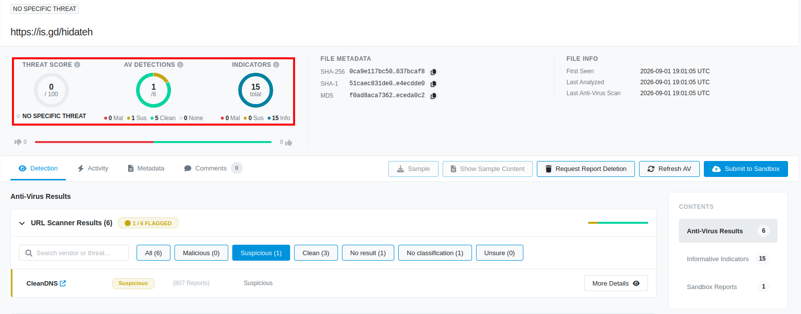
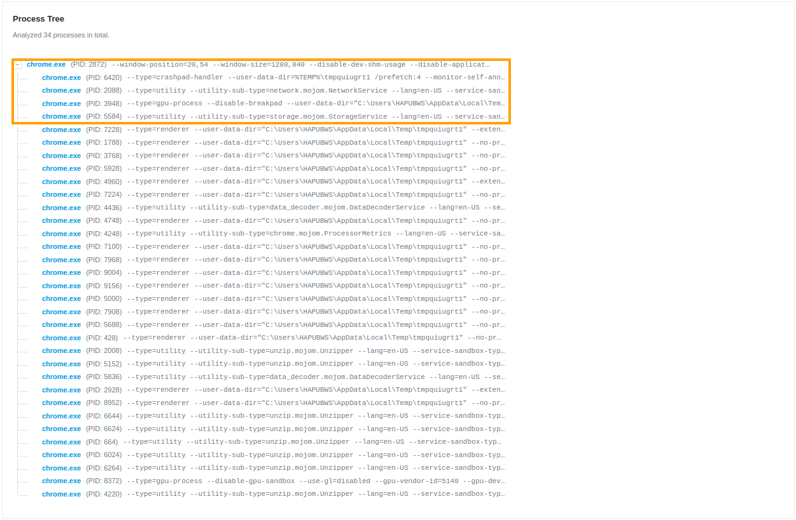
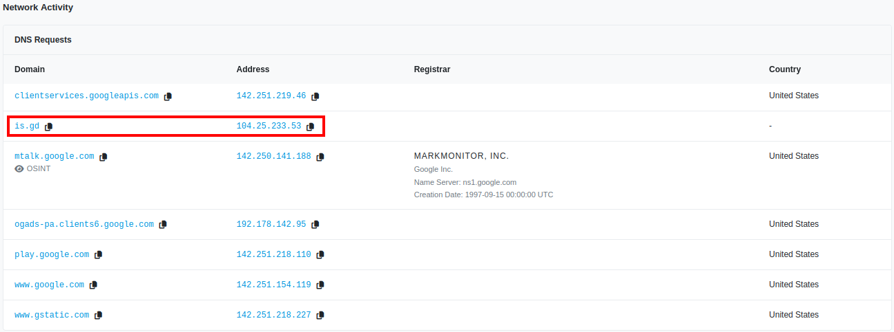

# Incident Report 02: Phishing Email & Dynamic Sandbox Triage

## 1. Executive Summary

During routine security monitoring, a suspicious email (`sample-7307.eml`) originally from `phishing_pot` was flagged for initial SOC triage. Header parsing revealed an encoded display name to evade text-based security filters.

Although initial email authentication checks (SPF, DKIM, and DMARC) passed due to the email originating from legitimate Google Cloud Infrastructure (`209[.]85[.]161[.]71`) via an attacker-created Google Firebase container, extracted payload URLs revealed high-risk obfuscation. The primary call-to-action link (`hxxps://is[.]gd/hidateh`) leveraged public link-shorteners and triggered 15 dynamic behavioral indicators during sandbox detonation, while secondary shortener (`hxxps://is[.]gd/vupivo`) returned a **3/95 malicious verdict** on VirusTotal. This investigation confirmed a targeted social engineering campaign exploiting trusted cloud platforms to bypass Secure Email Gateways (SEGs).

---

## 2. Environment & Tools 

* **Environment:** Insolated Linux Security VM
* **Raw Sample:** `phishing_pot/email/sample-7307.eml`
* **Parsing & Decoding:** Linux CLI (`grep`, `sed`, `awk`), CyberChef (RFC 2047/ Base64 Header Decoding, URL Defanging) 
* **Dynamic Sandbox:** Hybrid Analysis (CrowdStrike Falcon Sandbox) 
* **Threat Intelligence:** VirusTotal, AbuseIPDB

### Document Callout & Severity Legend

* :red_circle: **Red / Critical:** Confirmed Malicious Indicators (IOCs), high-risk VT scores, or malicious process spawns.
* :orange_circle: **Orange / High:** Suspicious network traffic, redirect chains, or parent execution processes.
* :yellow_circle: **Yellow / Medium:** Obfuscated headers, public link shorteners, or unverified domain redirects.
* :green_circle: **Green / Low:** Verified benign assets, authentic Google cloud infrastructure, and passing security checks (SPF/DKIM/DMARC). 

---

## 3. Header & Authentication Analysis

Initial analysis evaluated routing headers, MIME encoding, and authentication records to assess sender legitimacy and platform authorization. 

| Field | Header / Artifact Value | Triage Finding | Status |
| :--- | :--- | :--- | :--- | 
| **Header Sender (Form)** | `Free Trial Available <noreply@dwcbv-bdb24[.]firebaseapp[.]com>` | RFC 2047 Base64 encoded display name hiding spam lure | :yellow_circle: **ENCODED LURE** | 
| **Return-Path** | `noreply@dwcbv-bdb24[.]firebasesapp[.]com` | Envelope matches From domain; points to free Google Firebase container | :yellow_circle: **SUSPICIOUS (FIREBASE)** |
| **Originating MTA** | `mail-oo1-f71[.]google[.]com` (`209[.]85[.]161[.]71`) | Legitimate Google egress server used to relay message | :green_circle: **LEGIT MTA** |
| **Inbound Gateway** | `*[.]outlook[.]com` (`BL6EF...`, `SJ0PR...`) | Microsoft 365 Exchange Online Protection (EOP) ingestion path | :green_circle: **M365 INGEST** |
| **SPF Record** | `spf=pass` | Originating IP (`209[.]85[.]161[.]71`) authorized for Google Cloud/Firebase | :green_circle: **PASS** | 
| **DKIM Signature** | `v=1; a=rsa-sha256` | Valid cryptographic signature issued by Google Firebase domain | :green_circle: **PASS** | 
| **DMARC Status** | `dmarc=pass` | Domain alignment succeeds (`From` matches `Return-Path` domain) | :green_circle: **PASS (ABUSED INFRA)** | 

### Key Parsed Header Artifact 

```text 
From: =?UTC-8?B?8J+0gUZyZWUgVHJpYWwgQXZhaWxhYmxl?= <noreply@dwcbv-bdb24[.]firebaseapp[.]com>
Return-Path: <noreply@dwcbv-bdb24[.]firebaseapp[.]com>
Received: from mail-oo1-f71[.]google[.]com (209[.]85[.]161[.]71)
Authentication-Results: spf=pass; dkim=pass; dmarc=pass
```

**Analyst Note - Infrastructure Abuse & CyberChef Decoding:**
The `From:` header display name was obfuscated using RFC 2047 Base64 encoding (`=?UTF-8?B?8J+0gUZyZWUgVHJpYWwgQXZhaWxhYmxl?=`). Extract the string using `grep -i "From:" sample-7307.eml` and input the payload (`8J+0gUZyZWUgVHJpYWwgQXZhaWxhYmxl`) into CyberChef using the **From Base64** recipe to reveal the string: **`Free Trial Available`**. 

All email authentication checks (SPF, DKIM, DMARC) passed because the attacker created a free Google Firebase app container (`dwcbv-bdb24[.]firebasesapp[.]com`) to relay messages through Google's trusted infrastructure (`209[.]85[.]161[.]71`). This allowed the message to exploit cloud platform reputation and bypass initial mail filters.

---

## 4. Extracted URL Assessment & Reputation Lookup

To extract all embedded URLs cleanly from the raw email sample using the Linux terminal:

```bash
# Extract all HTTP/HTTPS links from the raw email file
grep -a -iEo '(http|https)://[^"<>]+' sample-7307.eml | sed 's^.$//' | sort -u 
```

Once extracted, defang the domain names (e.g., replace `http` with `hxxp` and `.` with `[.]`) before logging findings into the triage matrix: 

| Extracted URL | Triage Method | VirusTotal / AV Score | Behavioral / Context Findings | Status |
| :--- | :--- | :---| :--- | :--- | 
| **`hxxps://is[.]gd/hidateh`** | Dynamic Sandbox (Hybrid Analysis) | **1/6** (Hybrid Analysis) | 15 Suspicious Indicators; primary call-to-action redirect link | :yellow_circle: **SUSPICIOUS (DETONATED IOC)** |
| **`hxxps://is[.]gd/vupivo`** | Static VT Hash Lookup | :red_circle: **3/95** (VirusTotal) | Secondary shortened URL; flagged across multiple security feeds | :red_circle: **MALICIOUS** |
| **`hxxps://myplatinumtv[.]com/`** | Domain Reputation Lookup | :green_circle: **0/95** (VirusTotal) | Target hosting infrastructure / compromised root domain | :yellow_circle: **SUSPICIOUS** |
| **`hxxps://wa[.]me/18604690175`** | Domain Classification | :yellow_circle: **1/92** (VirusTotal) | Official WhatsApp deep-link; single false-positive engine flag | :green_circle: **BENIGN ASSET** |

**Analyst Note - Multi-Engine Triage & Low-Detection URLs:**
Dynamic sandbox execution of `hxxps://is[.]gd/hidateh` yielded an intial low static AV score (1/6) due to link-shortener abstraction (`is[.]gd`), but generated **15 dynamic behavioral indicators**. Cross-referencing this with static multi-engine lookup for the secondary link `hxxps://is[.]gd/vupivo` (**3/95 on VirusTotal**) confirms an active campaign utilizing multiple link shorteners to evade Secure Email Gateways (SEGs). 

---

## 5. Dynamic Behavioral Analysis (Hybrid Analysis) 

The primary URL (`hxxps://is[.]gd/hidateh`) was denotated in Hybrid Analysis (CrowdStrike Falcon Sandbox) under a controlled Windows 10 64-bit environment.



*Figure 1: Overview of Hybrid Analysis detonation summary.*

**Annotation Legend:**
* :red_circle: **Red Callout Box:** Highlights the threat classification score and dynamic behavioral indicator summary.

---



*Figure 2: Execution graph showing initial process execution.*

**Annotation Legend:**
* :orange_circle: **Orange Callout Box:** Highlights the parent browser process (`chrome.exe`) and initial execution chain during URL navigation. 

---



*Figure 3: Outbound DNS resolution requests captured during dynamic link detonation.* 

**Annotation Legend**
* :red_circle: **Red Callout Box:** Highlights the outbound DNS query for the `is[.]gd` link shortener domain.
* **Unhighlighted Rows:** Benign background browser telemetry (`mtalk[.]google[.]com`, `ogads-pa[.]clients6[.]google[.]com`).

**Analyst Note - Shared Infrastructure vs. Domain IOCs:**
While the target IP (`104[.]25[.]233[.]53`) belongs to legitimate Cloudflare CDN infrastructure, the dynamic DNS request for `is[.]gd` serves as the actionable host IOC confirming outbound redirection behavior.

---

## 6. MITRE ATT&CK Enterprise Mapping 

| Tactic | Technique ID | Technique Name | Lab Evidence / Observation |
| :--- | :--- | :--- | :--- | 
| **Initial Access** | `T1566.002` | Spearphishing Link | Extracted embedded hyperlinks directing recipient to external infrastructure. | 
| **Resource Development** | `T1583.001` | Domains | Compromised root domain (`myplatinumtv[.]com`) leveraged for hosting assets. | 
| **Defensive Evasion** | `T1027` | Obfuscated Links | Dual link-shorteners URLs (`is[.]gd/hidateh`, `is[.]gd/vupivo`) and Base64 header encoding. | 
| **Defensive Evasion** | `T1497.001` | Sandbox Evasion | Low initial AV detection (1/6) & conditional redirect execution during sandbox analysis. |
| **Defensive Evasion** | `T1656` | Impersonation | Exploitation legitimate cloud service (`firebaseapp[.]com`) reputation to bypass gateway filters. |

---

## 7. Remediation & SOC Recommendations 

1. **Secure Email Gateway (SEG) Policy:** Implement mail gateway rules to automatically inspect or block inbound emails containing high-risk public link shorteners (`is[.]gd`, `bit[.]ly`, `tinyurl[.]com`). 
2. **Cloud Tenant Inspection:** Implement tenant-level filtering for public cloud app hosts (`firebaseapp[.]com`, `herokuapp[.]com`) to flag inbound traffic originating from unverified app subdomains.
3. **Indicator Blocklist:** Ingest identified malicious shortener infrastructure (`is[.]gd/vupivo`, `is[.]gd/hidateh`) into edge firewall and web proxy blocklists.  
