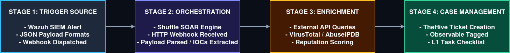

# Incident 04: SOAR Automation & Incident Ticketing 

## 1. Executive Summary

* **Objective:** Design and document an automated security orchestration and response (SOAR) pipeline to eliminate "swivel-chair" alert fatigue and standardize incident intake. 
* **Core Focus:** Transitioning from manual alert triage to an automated workflow using webhooks, ingestion engines, threat intelligence enrichment, and case management ticketing.
* **Outcome:** Streamlined data flow from raw SIEM alert to structured incident ticket, ensuring consistent evidence tagging and task tracking for Level 1 analysts. 

---

## 2. Architecture & Data Flow

Below is the end-to-end automated triage pipeline mapping how an alert transitions from raw ingestion to a managed security incident ticket. 

---

## 3. Workflow Breakdown (The 4-Stage Pipeline)

### Stage 1: Trigger Source (Wazuh SIEM)

* **Action:** A detection rule fire on the host/network (e.g., unauthorized access attempt). 
* **Mechanism:** The SIEM formats the telemetry into a structured JSON payload and fires an automated HTTP Webhook. 

### Stage 2: Orchestration & Parsing (Shuffle SOAR)

* **Action:** The webhook endpoint receives the payload.
* **Mechanism:** The automation engine parses variables (such as source IP addresses, destination ports, and file hashes) without manual analyst intervention. 

### Stage 3: Automated Intelligence Enrichment

* **Action:** Queried external threat databases. 
* **Mechanism:** The parsed indicators are automatically sent via API calls to open-source threat intelligence providers (e.g., VirusTotal / AbuseIPDB public tiers) to fetch reputation scores and context. 

### Stage 4: Case Management & Ticketing (TheHive)

* **Action:** Formal incident creation and task assignment.
* **Mechanism:** Enriched data, raw logs, and calculated risk scores are automatically injected into a central case management platform, generating a master case file, tagging observables, and assigning a standardized L1 investigation checklist. 

---

## 4. Key Artifacts & Components 

* **Webhooks:** Lightweight, stateless HTTP callbacks used to pass real-time alerts between tools.
* **Shuffle Engine:** Open-source automation logic handling data transformation and API queries. 
* **TheHive:** Centralized security incident response platform used for structuring evidence (Observables) and tracking investigation progress through standardized tasks. 

---

## 5. Operational Takeaways

By introducing basic orchestration and automated ticketing, the SOC achieves:

1. **Reduced Mean Time to Triage (MTT):** Routine indicator lookups happen instantly upon alert ingestion.
2. **Elimination of Human Error:** Standardized task lists ensure analyst follow identical triage steps for every matching alert type.
3. **Structured Audit Trails:** Every piece of evidence and action taken is automatically logged within the case file for compliance and post-incident review. 
